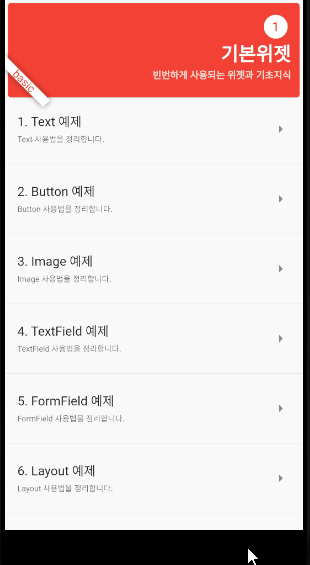

# FlutterTutorial

Flutter와 Dart 개발을 위한 가이드

- Dart 배우기
    - [처음 실행하기](dart_tutorial/basic.md)
    - [변수-Variable](dart_tutorial/variable.md)
    - [비교문, 반복문, switch, 널체크](dart_tutorial/condition.md)
    - [타입채크, 형변환](dart_tutorial/CastingTypeCheck.md)
    - [함수](dart_tutorial/function.md)
    - [Collections](dart_tutorial/collections.md)
    - [lambda와 closure](dart_tutorial/lambda_closure.md)
    - [class](dart_tutorial/class.md)
    - [abstract](dart_tutorial/abstract.md)
    - [mixin, extension](dart_tutorial/mixin_extension.md)
    - [비동기 - Stream](dart_tutorial/async_stream.md)
    - [비동기 - future](dart_tutorial/async_future.md)
    - [예외, typedef](dart_tutorial/exception_typedef.md)
    
- Flutter 배우기
    - [빠르게 구조파악](flutter_tutorial/start.md)
    - basic
      - [Text](flutter_tutorial/basic/TextExample.md)
      - [Button](flutter_tutorial/basic/ButtonExample.md)
      - [Image](flutter_tutorial/basic/ImageExample.md)
      - [TextField](flutter_tutorial/basic/TextFieldExample.md)
      - [FormField](flutter_tutorial/basic/FormFieldExample.md)
      - [Layout](flutter_tutorial/basic/LayoutExample.md)
      - [ListView](flutter_tutorial/basic/ListViewExample.md)
      - [Tab](flutter_tutorial/basic/TabExample.md)
      - [Tab2](flutter_tutorial/basic/TabExample2.md)
      - [Drawer](flutter_tutorial/basic/DrawerExample.md)
      - [Radio , Dropdown](flutter_tutorial/basic/RadioDropDownExample.md)
      - [Check, Indicator](flutter_tutorial/basic/CheckboxIndicatorExample.md)
      - [Dialog, Snackbar](flutter_tutorial/basic/DialogSnackbarExample.md)
      - [Cupertino](flutter_tutorial/basic/CupertinoExample.md)

    - IO
      - [File](flutter_tutorial/io/FileIOExample.md)
      - [Pref](flutter_tutorial/io/PrefExample.md)
      - [Asset](flutter_tutorial/io/AssetReadExample.md)
      - [HTTP](flutter_tutorial/io/HttpSimple.md)
      - [HTTP2](flutter_tutorial/io/HttpJsonExample.md)
      - [HTML](flutter_tutorial/io/HTMLParserExample.md)

    - StateManagement
      - [Key](flutter_tutorial/statemanagement/KeyExample.md)
      - [InheritedWidget](flutter_tutorial/statemanagement/InheritedWidgetExample.md)
      - [Provider](flutter_tutorial/statemanagement/ProviderExample.md)
      - [StreamBuilder](flutter_tutorial/statemanagement/StreamBuilderExample.md)

    - etc
      - [RefreshIndicator](flutter_tutorial/etc/RefreshIndicatorExample.md)
      - [StaggeredGridView](flutter_tutorial/etc/StaggeredGridViewExample.md)
      - [HorizontalListExample](flutter_tutorial/etc/HorizontalListViewExample.md)
      - [Sliver Example](flutter_tutorial/etc/SliverExample.md)
      - [Permission Example](flutter_tutorial/etc/PermissionExample.md)
      - [Share Example](flutter_tutorial/etc/ShareExample.md)
      - [Channel Example](flutter_tutorial/etc/ChannelExample.md)
      - [Theme Example](flutter_tutorial/etc/ThemeExample.md)
      - [PageView Example](flutter_tutorial/etc/PageViewExample.md)
      - [WebView Example](flutter_tutorial/etc/WebViewExample.md)
      - [BackPressed Example](flutter_tutorial/etc/BackPressedExample.md)

- 기본설정
    - [빠르게 시작하기](flutter_tutorial/first.md)

----

#### Flutter v2.10 migration
> Android에서 수정할 내용 정리

1.AndroidManifest.xml에서 이름변경
~~~
<application
        android:name="${applicationName}"
    
~~~

2.AndroidStudio의 하단 터미널에서 커맨드 입력
~~~
flutter upgrade
flutter pub upgrade
flutter pub outdated
~~~

3. 몇몇 플러그인들은 구조가 바뀌어서 코드수정 및 삭제가 필요함.
4. app의 Gradle 정보를 수정해야 함
~~~
android {
   ...
    defaultConfig {
        ...
        // v2.10용 추가
        minSdkVersion 19
        compileSdkVersion 31
    }

   
}
~~~
5. (android) project의 gradle 정보에서 kotlin 버전정보를 1.6.10 이상으로 설정
~~~
buildscript {
    ext.kotlin_version = '1.6.10'
    ... 
}
~~~
6. Gradle 버전을 6.1.1 이상으로 설정( gradle-wrapper.properties )
~~~
#Fri Jun 23 08:50:38 CEST 2017
distributionBase=GRADLE_USER_HOME
distributionPath=wrapper/dists
zipStoreBase=GRADLE_USER_HOME
zipStorePath=wrapper/dists
distributionUrl=https\://services.gradle.org/distributions/gradle-6.1.1-all.zip

~~~

#### Flutter v3.0 migration
> OutlineButton에서 에러발생하여 주석처리
~~~
1. 타겟변경후 컴파일시 package name 에러가 발생한다면 프로젝트 폴더를 무조건 소문자로 변경해야 한다.
2. window의 경우 개발자 모드로 설정 요구함(콘솔에서 입력)
start ms-settings:developers
~~~