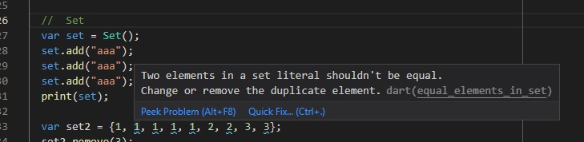

### Collections
> List, Set, Map 정리하기 

- [전체소스](collections.dart)
- [dartpad로 실행하기](https://dartpad.dev/4f433b17a17c1e903c60f6d2f09bbf4c)

1. List(), [] 로 객체생성
~~~dart
  var lst = List();
  lst.add("1");
  lst.add(1);
  print (lst);
~~~
2. <> 제너릭으로 선언안하면 다양한 값을 넣을 수 있음.
~~~dart
  var lst2 = [12, "A", 34.2];
~~~
3. ...로 각 item을 추가할 수 있음(list 객체의 addAll과 유사).
~~~dart
  var lst2 = [12, "A", 34.2];
  lst2.add ("huk");
  lst2.add(lst);
  print(lst2);
  
  var lst3 = [1, 2,...lst2];
  print(lst3);
~~~

4. set은 List와 유사하나 item이 중복안됨.
    - vscode에서 경고화면

5. Set(), {}로 객체생성.
6. Map(), {}로 객체생성.