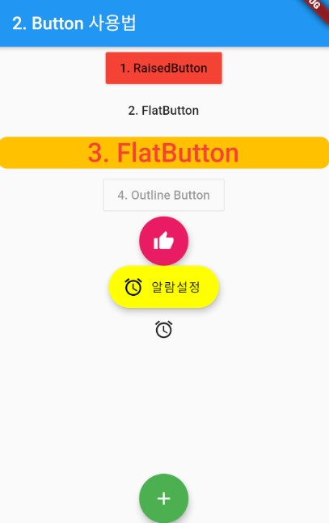

### Button 위젯 
> Button 위젯의 사용법 정리

- [전체소스](../../lib/basic/ButtonExample.dart)
- [dartpad로 실행하기](https://dartpad.dev/6161485824ca1bdf25d970acc4cf5d4f?null_safety=true)

- RaisedButton(윤곽이 있는 모양), FlatButton(윤곽이 없는 모양)
- 클릭에 대한 처리는 onPressed 파라메터에 함수를 구현해서 넘김
- child 파라메터로 Text를 생성하여 버튼에 문자열을 표시함 
- 버튼의 크기를 조절할 경우, SizedBox 안에 자식위젯(child)으로 생성
- SizedBox는 위젯의 크기를 조절할 경우 사용함
    ~~~dart
    // Button 예제
    RaisedButton(onPressed: () {/*이벤트 핸들러*/}, child: Text('1. RaisedButton')),
    FlatButton(onPressed: () {/*이벤트 핸들러*/}, child: Text('2. FlatButton')),
    SizedBox(
      width: double.infinity, // <-- match_parent
      child: FlatButton(
        color: Colors.amber,
        onPressed: () { Fluttertoast.showToast("안녕하세요~"); },
        child: Text(
          '3. FlatButton',
          style: TextStyle(color: Colors.red, fontSize: 30),
        )
      )    
    )
    ~~~

- 모든 위젯은 자식 위젯이 1개일 때는 child, 여러개일 때는 children이라는 필드를 사용한다. 
- Fluttertoast를 사용하기 위해서는 플러그인을 포함시켜야한다.
