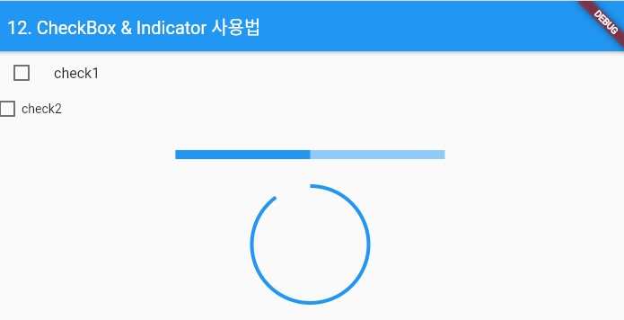

### CheckboxListTile, CircularProgressIndicator 위젯 
> 위젯의 사용법 정리

- [전체소스](../../lib/basic/CheckIndicatorExample.dart)
- [dartpad로 실행하기](https://dartpad.dev/4c42c0ad2100ca04285c26946eed5f7e?null_safety=false)

- CheckboxListTile 위젯은 채크박스와 문자열을 ListTile 형태로 구현한 위젯이다. 
- **value**에 true/false를 지정한다. 
- 변경시, onChanged에 (value){}의 함수를 정의한다. vaule 값으로 선택된 상태를 관리한다. 

~~~dart
  ...
  
  CheckboxListTile(
      controlAffinity: ListTileControlAffinity.leading,
      title: Text('check1'),
      value: _isChecked,
      onChanged: (value) {
        setState(() {
        _isChecked = !_isChecked;
      });
    },
  ),

  ...
  
~~~

- Checkbox 위젯은 채크박스만 구현한 위젯이다. 
- **value**에 true/false를 지정한다. 
- 변경시, onChanged에 (value){}의 함수를 정의한다. vaule 값으로 선택된 상태를 관리한다. 

~~~dart
  ...
  
  Checkbox(
    value: _isChecked2,
    onChanged: (value) {
      setState(() {
        _isChecked2 = !_isChecked2;
      });
    },
  ),

  ...
  
~~~

- LinearProgressIndicator 위젯과 CircularProgressIndicator 위젯은 진행상태를 보여주는 위젯이다. 
- **value**에 값을 지정한다. 

~~~dart
  ...
  
  // Line 형태
  child: LinearProgressIndicator(
    value: 0.5,
  ),

  ...
  
  // Circular 형태 
  child: CircularProgressIndicator(
    value: 0.5,
  ),

~~~

