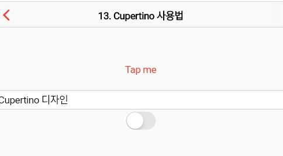

### Cupertino 위젯 
> 위젯의 사용법 정리

- [전체소스](../../lib/basic/CupertinoExample.dart)
- [dartpad로 실행하기](https://dartpad.dev/a050e73a059e90b1fab442465973212d?null_safety=false)

- Cupertino 위젯은 iOS 디자인 컨셉의 위젯이다. 
- **CupertinoPageScaffold**안의 child로 iOS 디자인 스타일의 위젯을 사용할 수 있다. Scaffold의 iOS 버전이다. 
    - CupertinoNavigationBar는 appBar와 같은 기능을 한다. 
    - CupertinoTextField는 TextField와 같은 기능을 한다. 
    - CupertinoButton은 iOS 스타일의 Button이다.   
    - CupertinoSwitch는 iOS 스타일의 Switch이다. 
- **platform**을 구분하는 법은 Theme.of(context).platform의 값이 iOS인지 android인지로 구분하면 된다.  

~~~dart
  ...
  
  String checkiOS(BuildContext context, String sMessage) {
    var platform = Theme.of(context).platform;
    if (platform == TargetPlatform.android) {
      sMessage = 'Android 환경에서 Cupertiono';
    }
    return sMessage;
  }

  ...
  
~~~

