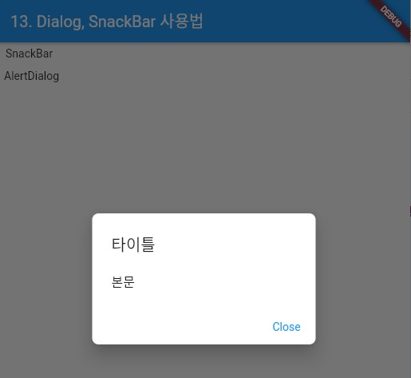

### CheckboxListTile, CircularProgressIndicator 위젯 
> 위젯의 사용법 정리

- [전체소스](../../lib/basic/DialogSnackBarExample.dart)
- [dartpad로 실행하기](https://dartpad.dev/b27c07a7bc9af6b39cb7b953e53699a9?null_safety=false)

- showSnackBar는 Context가 필요하다. 그러므로 GlobalKey()로 넘겨받던지, Builder()를 이용해 Context를 전달받아야 한다. 
- **Scaffold**의 Context(=ctx)를 이용해 Scaffold.of(ctx).showSnackBar 호출하며 SnackBar를 생성하여 넘겨준다. 
    - content에 Widget을 구현한다.  

~~~dart
  ...
  
  Builder buildSnackBarBuilder() {
    // Context를 얻기위해 Builder로 감싼다.
    return Builder(builder: (BuildContext context) {
      return FlatButton(
          onPressed: () {
            showSnackBar(context, "Hi");
          },
          child: Text('SnackBar'));
    });
  }

  void showSnackBar(BuildContext ctx, String s) {
    Scaffold.of(ctx).showSnackBar(SnackBar(content: Text(s)));
  }

  ...
  
~~~

- showDialog는 비동기적으로 Dialog를 화면에 보여준다. 
- **context**를 부모에게서 넘겨받아야 한다. 
- barrierDismissible는 Dialog 영역밖을 터치하면 종료할 지를 결정한다.   
- builder에서 반환되는 값으로 AlertDialog를 구현해서 넘긴다. 
    - title: 제목
    - contents: 본문 위젯 
    - actions: 버튼리스트

~~~dart
  ...
  
  void showAlertDialog(BuildContext context) {
    showDialog(
      context: context,
      barrierDismissible: false,
      builder: (BuildContext context) {
        return AlertDialog(
          shape:
              RoundedRectangleBorder(borderRadius: BorderRadius.circular(8.0)),
          title: new Text("타이틀"),
          content: Text("본문"),
          actions: <Widget>[
            new FlatButton(
              child: new Text("Close"),
              onPressed: () {
                Navigator.pop(context);
              },
            ),
          ],
        );
      },
    );
  }

  ...
  
~~~

