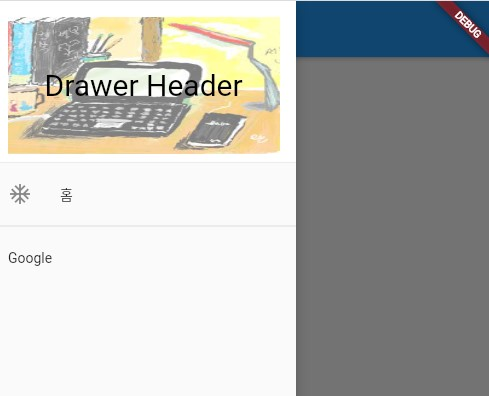

### Drawer 위젯 
> Drawer 위젯의 사용법 정리

- [전체소스](../../lib/basic/DrawerExample.dart)
- [dartpad로 실행하기](https://dartpad.dev/f1845f8403ab0c9a140e328fb950a015?null_safety=false)

- Scaffold 위젯 안에서...
- **drawer**에 Drawer 위젯을 정의한다.
- Drawer 위젯은 어떤 위젯을 만들어도 상관없으나 ListView 안에 DrawerHeader 위젯을 넣고 아래에 ListTile로 꾸미는 것이 일반적인 모습이다.
- GlobalKey<ScaffoldState>로 정의된 변수에서 currentState.isDrawerOpen()을 이용하여 openEndDrawer(), openDrawer()를 사용하며 Drawer를 열고 닫을 수 있다.

~~~dart
  if (_scaffoldKey.currentState.isDrawerOpen) {
    _scaffoldKey.currentState.openEndDrawer();
  } else {
    _scaffoldKey.currentState.openDrawer();
  }    
~~~

- 메인화면은 Scaffold의 body에서 상태값에 따라 변경하는 코드를 구현하면 된다. 

~~~dart

// Drawer 선택시 화면을 만든다.
Center buildMainPage() {
  var page = Center(child: Text(""));
  switch (pageSelected) {
    case 0:
      page = Center(child: Text("Home 화면"));
      break;
    case 1:
      page = Center(
          child: Image.network(
              "https://www.google.com/images/branding/googlelogo/1x/googlelogo_color_272x92dp.png"));
      break;
    default:
  }

  return page;
}

~~~

  
