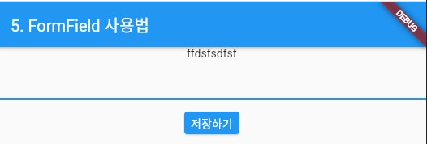

### FormField 위젯 
> FormField 위젯의 사용법 정리

- [전체소스](../../lib/basic/FormFieldExample.dart)
- [dartpad로 실행하기](https://dartpad.dev/2697c38e396a4c390a047530559dece8?null_safety=false)

- FormField를 사용하려면 StateFulWidget이나 Status 클래스에서 GlobalKey<FormState>();를 사용하여 변수를 선언한다. 
    ~~~dart
    // 상태 갱신을 위한 위젯 (StatefulWidget)
    class RootWidget extends StatefulWidget {
      String _title = "Test";
      // Form의 상태관리
      final _formKey = GlobalKey<FormState>();

      @override
      RootWidgetState createState() {
        return RootWidgetState();
      }
    }
    ~~~
- Status에서 화면을 build 할 때, Form() 객채의 키값으로 _formKey를 넘긴다. 
    ~~~dart
    Form(
      key: widget._formKey,
      child: ...    
        
    ~~~
- FormField의 값을 저장하기 위해 ElevatedButton의 onPressed에서 
- widget._formKey.curentState.validate()를 통해 변경된 값이 있는 지 채크한다.
- 값이 변경되었다면 widget._formKey.curentState.save()를 통해 Form내의 값을 저장한다.
- reset()을 통해 값을 초기화 한다. 
    ~~~dart
    child: ElevatedButton(
      onPressed: () {
        if (widget._formKey.currentState.validate()) {
          // 상태저장 후, 리셋
          widget._formKey.currentState.save();
          widget._formKey.currentState.reset();
        }
      }
    ),   
    ...    
    ~~~

- onSaved에서는 widget._formKey.curentState.save()가 실행될 시 호출된다. (value){}의 형태로 되어있다. value의 값을 처리하면 된다.  
- TextFormField에서 validator는 값이 변경될 때 처리한다. (value){}형의 함수를 구현하여 변경된 값을 처리한다. 
- TextFormField에서 keyboardType는 키보드로 입력되는 값을 필터링하는 곳이다. TextInputType.phone는 전화번호값만 입력받는다.

    ~~~dart
    TextFormField(
        validator: (value) {
          if (value.length < 1) {
            return '값을 입력해주세요';
          }
          return null;
        },

        keyboardType: TextInputType.phone,

        // _formKey.currentState.save() 호출시
        onSaved: (newValue) {
          print("TextFormField onSaved -> $newValue");

          // 화면갱신
          setState(() {
            widget._title = "$newValue";
          });
        },
    ),
    ~~~

