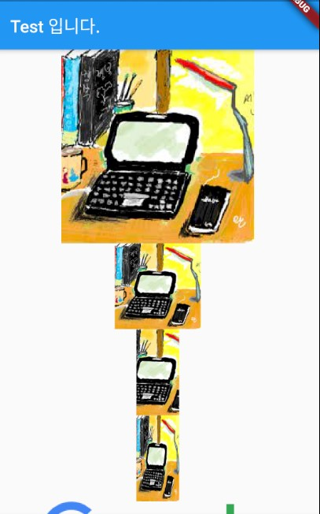

### Image 위젯 
> Image 위젯의 사용법 정리

- [전체소스](../../lib/basic/ImageExample.dart)

- pubspec.yaml에 asset 폴더를 지정한다. 
  ~~~
  assets:
      - assets/images/
  ~~~
- 프로젝트 루트폴더에 assets/images/ 폴더를 만들고 이미지를 복사한다. 
- Image.asset()을 통하여 경로를 지정하면 이미지를 읽어온다. 
- width와 height로 크기를 지정한다.  
- fit 파라메터는 이미지원본을 Image에 어떻게 적용할 것이지 지정한다.
- BoxFit.cover(원본 비율을 유지하고 가득 채운다),  BoxFit.fill(크기에 맞추어 비율을 재조정하고 가득 채운다)
    ~~~dart
    // Image 예제
        Center(
          child: Image.asset(
            "assets/images/title.jpg",
          ),
        ),
        Center(
          child: Image.asset(
            "assets/images/title.jpg",
            width: 100,
            height: 100,
          ),
        ),
        Center(
          child: Image.asset(
            "assets/images/title.jpg",
            width: 50,
            height: 100,
            fit: BoxFit.cover,
          ),
        ),
        Center(
          child: Image.asset(
            "assets/images/title.jpg",
            width: 50,
            height: 100,
            fit: BoxFit.fill,
          ),
        ),
        Center(
          child: Image.network(
              "https://www.google.com/images/branding/googlelogo/1x/googlelogo_color_272x92dp.png"),
        )
    ~~~

- network() 메소드는 인터넷을 통해 이미지를 로딩한다.
