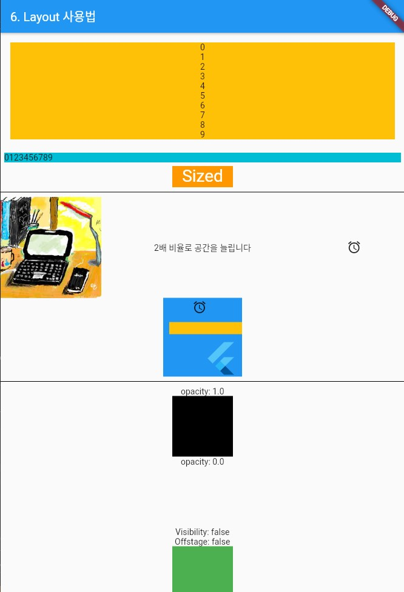

### Layout 위젯 
> Layout 위젯의 종류와 사용법 

- [전체소스](../../lib/basic/LayoutExample.dart)
- [dartpad로 실행하기](https://dartpad.dev/6dfb1ab832eb519ed9c2cb5f2fcff10b?null_safety=true)

- Center 위젯은 자식위젯의 위치를 중앙정렬한다. 자식위젯은 child로 넘긴다. double.infinity는 Android MATH_PARENTS와 같다. 화면크기로 채울 때 사용한다. 
- Container 위젯은 width, height, color를 지정하여 영역을 지정할 때 사용한다. margin에 마진값을 EdgeInsets.all(크기)와 같이 지정할 수 있다. 자식위젯은 child로 넘긴다. 
- Column 위젯은 자식위젯의 순서대로 위에서 아래로 배치시킨다. 자식위젯은 children으로 리스트 형태로 넘긴다. 

  ~~~dart
  Center buildCenterColumn() {
    return Center(
      child: Container(
          color: Colors.amber,
          width: double.infinity,
          margin: EdgeInsets.all(16),
          child: Column(
            children: [for (int i = 0; i < 10; i++) Text("$i")],
          )),
    );
  }
  ~~~

- Row 위젯은 자식위젯의 순서대로 왼쪽에서 오른쪽로 배치시킨다. 자식위젯은 children으로 리스트 형태로 넘긴다. 
- Expanded 위젯은 빈공간을 확장하는 위젯이다. flex로 비율을 정할 수 있다. 자식위젯은 child로 넘긴다.

  ~~~dart
  Row buildRow() {
    return Row(children: [
      Expanded(child: Image.asset("assets/images/title.jpg")),
      Expanded(
          flex: 2, child: Text('2배 비율로 공간을 늘립니다', textAlign: TextAlign.center)),
      Expanded(
        child: Icon(Icons.access_alarms),
      )
    ]);
  }
  ~~~

- SizedBox 위젯은 주로 자식의 크기를 지정하거나 위젯간의 간격을 만들 때 사용된다. 
- 때에 따라 Container를 사용하는 것이 효율적일 때가 많다.

  ~~~dart
  SizedBox buildSizedBox() {
    return SizedBox(
        width: 100,
        height: 35,
        child: Container(
            width: double.infinity,
            color: Colors.orange,
            child: Text(
              "Sized",
              textAlign: TextAlign.center,
              style: TextStyle(fontSize: 28, color: Colors.white),
            )));
  }
  ~~~

- Stack은 Android의 FrameLayout과 유사하다. 레이아웃을 겹치게 올려놓는 것이다. 자식위젯은 children으로 리스트 형태로 넘긴다. 
- Positioned 위젯은 top, left, right, bottom, width, height를 크기와 위치를 지정할 때 사용한다. 자식위젯은 child로 넘긴다. fill() 메소드는 child 크기만큼 가득채울 때 사용한다.

  ~~~dart
  Center buildCenter() {
    return Center(
      child: Stack(
        children: <Widget>[
          Container(
            width: 130,
            height: 130,
            color: Colors.blue,
          ), //Container
          // 위치지정
          Positioned(
              top: 40,
              left: 10,
              child: Container(
                height: 20,
                width: 120,
                color: Colors.amber,
              )), //Container
          Positioned.fill(
              top: -100, left: -10, child: Icon(Icons.access_alarm)),
          Positioned.fill(
              top: 70, left: 60, child: FittedBox(child: FlutterLogo()))
        ], //<Widget>[]
      ), //Stack
    );
  }
  ~~~ 

- Opacity 위젯은 공간을 할당하고 투명도를 조절하는 위젯이다. 0.0으로 설정해도 빈공간을 유지한다.  
- Visibility 위젯은 공간할당없이 위젯을 보이지 않게 할 때 사용한다. visble의 값을 true/false로 지정한다.  
- Offstage 위젯은 공간할당없이 위젯을 보이지 않게 할 때 사용한다. offstage 값을 true/false로 지정한다.  

  ~~~dart
  Widget buildInVisibleVisible(){
    return Center( child: Column(children: [
      Text("opacity: 1.0"),
      Opacity(opacity: 1.0, child: Container(width: 100, height: 100, color: Colors.black)),

      // 공간 할당하고 보이지 않는다.
      Text("opacity: 0.0"),
      Opacity(opacity: 0.0, child: Container(width: 100, height: 100, color: Colors.red)),

      // 공간 할당없이 보이지않는다.
      Text("Visibility: false"),
      Visibility(visible: false, child: Container(width: 100, height: 100, color: Colors.green)),

      // 공간 할당없이 보이지않는다.
      Text("Offstage: false"),
      Offstage( offstage: false, child: Container(width: 100, height: 100, color: Colors.green)),

      Text("Visibility: true"),
      Visibility(visible: true, child: Container(width: 100, height: 100, color: Colors.black)),
    ]));
  }
  ~~~

- ClipRect 위젯은 자식위젯의 테두리를 짜를 때 사용하는 위젯이다. clipper에 Rect 값을 지정할 수 있다. 
- ClipRRect 위젯은 둥근 테두리를 만들 때 사용한다. borderRadius에 BorderRadius.circular(값)을 이용하여 각도를 조절할 수 있다.  
- Align 위젯은 자식위젯의 Align을 설정할 때 사용한다. alignment와 widthFactor, heightFactor를 설정하여 위치와 간격을 조절한다.   

  ~~~dart
  ClipRect buildClipRect() {
    return ClipRect(
      child: Align(
        alignment: Alignment.topCenter,
        widthFactor: 0.75,
        heightFactor: 0.75,
        child: SizedBox(width: 150, height: 150, child: Image.network(
            "https://miro.medium.com/max/1600/1*-e5Hl_0novHiOgPNVXzNLw.gif"),),
      ),
    );
  }

  Widget buildClipRectCenter() {
    return Container(width: 80, height: 80, child: ClipRRect(
      borderRadius: BorderRadius.circular(15.0),
      child: Align(
        alignment: Alignment.topCenter,
        widthFactor: 1,
        heightFactor: 1,
        child: Image.network(
            "https://www.fightersgeneration.com/nf7/char/king-tekken3-frankensteiner-on-lei.gif"),
      ),
    ),);
  }
  ~~~