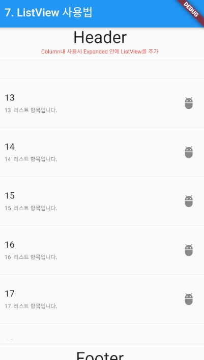

### ListView 위젯
> ListView 위젯의 사용법 정리

- [전체소스](../../lib/basic/ListViewExample.dart)
- [dartpad로 실행하기](https://dartpad.dev/eb1ae9dbd827cf1f3a8e5d3cb08ba63d?null_safety=true)

- ListView 위젯은 리스트뷰를 구현하는 위젯이다. separated() 메소드는 구분선을 포함하고 builder()는 구분선을 포함하지 않을 때 사용한다.
  - itemCount는 리스트데이터의 크기를 정한다.
  - separatorBuilder는 구분선을 지정할 때 사용한다. (context, index) {}형의 함수를 구현한다.
  - itemBuilder는 리스트 아이템을 구현한다. (context, index) {}형의 형태로 보이지만 Widget을 반드시 리턴해야 한다.
  - GestureDetector() 위젯은 탭(터치)을 처리하기 위한 위젯이다. onTab에서 항목을 터치했을 때, 코드를 구현한다.
    ~~~dart
    Expanded(
      child: ListView.separated(
         //ListView.builder를 사용하면 세퍼레이터(구분선)를 설정하지 않아도된다.
         itemCount: lst.length,
         separatorBuilder: (context, index) {
         // 항목에 따라 안보여줄 수도 있다.
         if (index == 0) return SizedBox.shrink();
           return const Divider();
         },
         itemBuilder: (context, index) {
           return GestureDetector(
             child: buildListItem(lst, index),
             onTap: () {
               showSnackBar(context, "${lst[index]}을 선택했습니다.");
             },
           );
         }
       )

    ~~~

- buildListItem()은 내부에서 ListTile 위젯을 리턴한다.
- ListTile 위젯은 리스트에서 흔히 보여지는 형태의 아이템을 미리구현한 템플릿 위젯이다.
- title, subtitle, trailing에 원하는 위젯을 생성하며 사용할 수 있다.
    ~~~dart
    Widget buildListItem(List<String> lst, int index) {
      return ListTile(
        title: Text(lst[index]),
        subtitle: Text(
          "${lst[index]} 리스트 항목입니다.",
          style: TextStyle(fontSize: 10),
        ),
        trailing: Icon(Icons.adb),
      );
    }

    void showSnackBar(BuildContext ctx, String s) {
      Scaffold.of(ctx).showSnackBar(SnackBar(content: Text(s)));
    }
    ~~~
