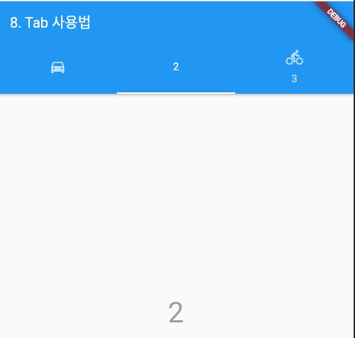

### Tab 위젯
> Tab 위젯의 사용법 정리

- [전체소스](../../lib/basic/TabExample.dart)
- [dartpad로 실행하기](https://dartpad.dev/54bcbeffa1aec6041f6a33badc7d26ef?null_safety=true)

DefaultTabController을 사용하면 Tab을 사용하는 위젯의 전형적인 템플릿을 쉽게 사용할 수 있다. 

- DefaultTabController안에 Scaffold 위젯을 child로 배치한다.
  - AppBar의 bottom에 TabBar를 생성한다. 그리고 TabBar의 tabs에 List 형태로 Tab에 들어갈 위젯을 정의한다. 
  - Scaffold의 Body를 TabBarView 위젯으로 정의한다.
  - TabBarView 위젯의 children에 상단탭 선택했을 때 표시되는 위젯을 리스트 형태로 정의한다.
    ~~~dart
    Widget buildTestBody() {
      return DefaultTabController(
        // 탭의 수 설정
        length: 3,
        child: Scaffold(
          appBar: AppBar(
            // TabBar
            title: Text(sTitle),
            bottom: TabBar(
              // 3개
              tabs: [
                Tab(icon: Icon(Icons.directions_car)),
                Tab(text: "2"),
                Tab(icon: Icon(Icons.directions_bike), text: "3"),
              ],
            ),
          ),

          // TabVarView
          body: TabBarView(
            // 3개
            children: [
              // tabs 갯수에 맞게 위젯구현
              Center(
                child: Text(
                  "1",
                  style: TextStyle(fontSize: 40, color: Colors.black38),
                ),
              ),
              ...
              )
            ],
          ),
        ),
      );
    }
    ~~~

