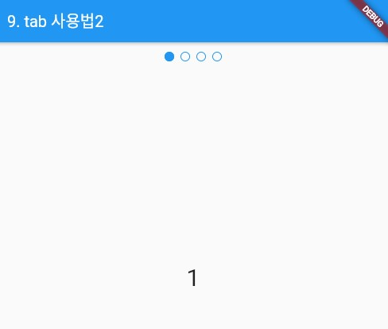

### Tab 위젯 - 2 
> Tab 위젯의 사용법 정리

- [전체소스](../../lib/basic/TabExample2.dart)
- [dartpad로 실행하기](https://dartpad.dev/12e91713c98fe054f9d57f7901ba7071?null_safety=true)

DefaultTabController을 사용하면서 TabPageSelector()를 사용하는 예제. 

- DefaultTabController안에 Scaffold 위젯 안에서...
  - **Context 변수를 사용해야 할 경우가 생기므로 Builder() 위젯을 생성**하고 builder에 구현할 위젯을 정의한다. 
  - TabPageSelector()를 이용하여 Selector를 구현한다.
  - TabBarView 위젯의 children에 상단탭 선택했을 때 표시되는 위젯을 리스트 형태로 정의한다.
  - Tab 이동은 DefaultTabController.of(context)로 객체를 가져와 객체.animateTo(인덱스)로 이동한다. 

    ~~~dart

    static const tabViewes = 
[
      Center(child: Text("1", style: TextStyle(fontSize: 30))),
      Center(child: Text("2", style: TextStyle(fontSize: 30))),
      Center(child: Text("3", style: TextStyle(fontSize: 30))),
      Center(child: Text("4", style: TextStyle(fontSize: 30)))
    ];

    ...

    DefaultTabController buildDefaultTabController() {
      return DefaultTabController(
        length: tabViewes.length,
        child: Builder(
          // callback으로 호출될 때 그린다.
            builder: (BuildContext context) => Padding(
            padding: const EdgeInsets.all(8.0),
            child: Column(
              children: <Widget>[
                TabPageSelector(),
                Expanded(
                  child: TabBarView(children: tabViewes),
                ),
                RaisedButton(
                  child: Text('끝으로 이동'),
                  onPressed: () {
                    final TabController controller =
                        DefaultTabController.of(context);
                    if (!controller.indexIsChanging) {
                      controller.animateTo(tabViewes.length - 1);
                    }
                  },
                )
              ],
            ),
          ),
        ),
      );
    }
    
    ~~~

