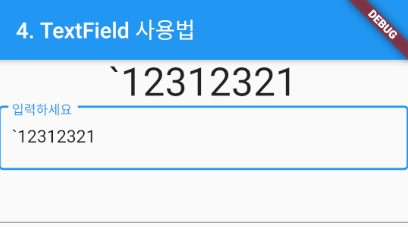
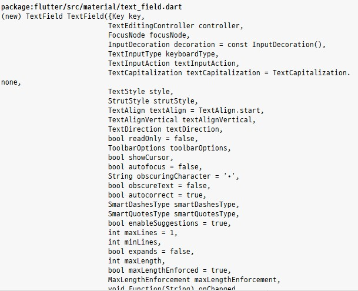

### Text 위젯 
> Text 위젯의 사용법 정리

- [전체소스](../../lib/basic/TextFieldExample.dart)
- [dartpad로 실행하기](https://dartpad.dev/4efcdb304b6e042776716ebef84f062c?null_safety=true)

- TextField의 파라메터로 onChanged 변수를 통해 이벤트 핸들러를 구현하여 입력값의 변화를 변수와 바인딩 할 수있다.
    ~~~dart
    // TextField 예제
    TextField(
      onChanged: (text) {
        setDisplay(text);
      },
    ),
        
    TextField(
      controller: editController,
    )
    ~~~

- controller 변수를 통해서도 객체를 넘겨서 addListener()를 통해 핸들러를 작성할 수 있다. initState()에서 구현하고 dispose()에서 해제해주어야 한다.
    ~~~dart
    // TextField 예제
    TextField(
      onChanged: (text) {
        setDisplay(text);
      },
    ),
        
    TextField(
      controller: editController,
    )
    
    ...
    
    // 초기화
    @override
    void initState() {
      super.initState();
      editController.addListener(() {
        setDisplay(editController.text);
      });
    }

    // 종료될 시
    @override
    void dispose() {
      editController.dispose();
      super.dispose();
    }
    ~~~

- 입력 파라메터로 style에 TextStyle()을 넘겨주며 텍스트를 꾸민다.

- TextStyle은 주로 글자크기와 색상을 지정할 때 사용한다.     