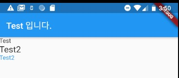
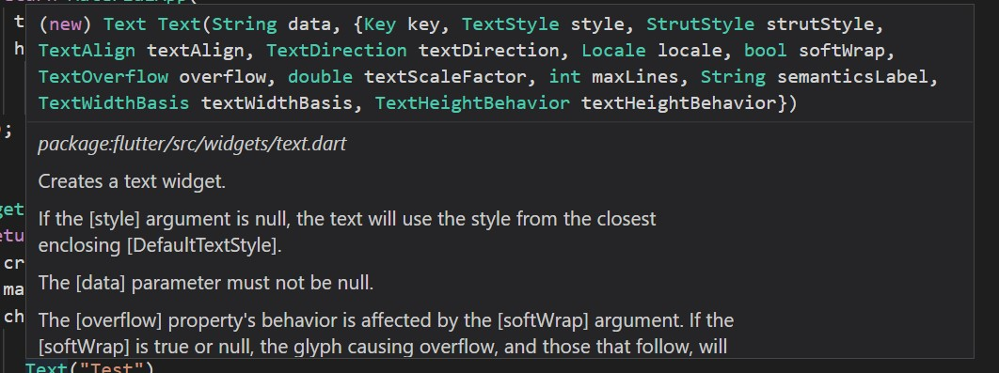

### Text 위젯 
> Text 위젯의 사용법 정리

- [전체소스](../../lib/basic/TextTest.dart)
- [dartpad로 실행하기](https://dartpad.dev/6161485824ca1bdf25d970acc4cf5d4f?null_safety=true)

- 화면에 문자열을 출력하는 기본적인 위젯
- VSCode에서 ctrl 키를 누른 상태로 마우스 캐럿을 Text()에 가져가면 도움말 표시
- 
- 입력 파라메터로 style에 TextStyle()을 넘겨주며 텍스트를 꾸민다. 
    ~~~dart
    Text("Test"), 
    Text("Test2", style: TextStyle(fontSize: 20)),
    Text("Test2", style: TextStyle(color: Colors.blue))
    ~~~

- TextStyle은 주로 글자크기와 색상을 지정할 때 사용한다.     