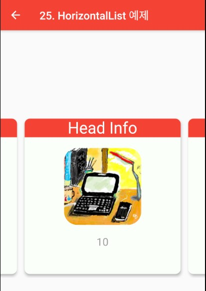

### PageView
> Flutter에서 PageView를 이용한 가로스크롤 화면

- [전체소스](../../lib/advance/HorizontalListExample.dart)
- [dartpad로 실행하기](#) - Dartpad 지원안함

- PageView 위젯의 builder에서 화면을 구성한다.
  - controller는 화면에 보여줄 Item의 간격을 조절한다.
  - crossAxisSpacing, mainAxisSpacing는 Item간의 간격이다.
  - onPageChanged는 viewport가 변경될 시( 중앙에 보이는 아이템이 이동시 ) 발생된다. (int index){} 함수를 구현하여 상태를 처리한다.
  - itemBuilder는 (_, i) { returnb 위젯}형의 함수로 Item 화면을 구현한다. 이 예제에서는 Transform.scale를 이용하여 비율을 정한다.
  - Transform.scale에서
    - scale은 비율이다.
    - child는 비율을 적용할 위젯이다.

~~~ dart
import 'package:flutter/material.dart';

class HorizontalListExample extends StatefulWidget {
  @override
  _HorizontalListExampleState createState() => new _HorizontalListExampleState();
}

class _HorizontalListExampleState extends State<HorizontalListExample> {

  @override
  void initState() {
    super.initState();
  }

  @override
  Widget build(BuildContext context) {
    int _index = 0;
    return Scaffold(
      appBar: AppBar(
        title: new Text("25. HorizontalList 예제"),
      ),
      body: Center(
        child: SizedBox(
          height: 300,
          child: PageView.builder(
            itemCount: 30,
            controller: PageController(viewportFraction: 0.8),
            onPageChanged: (int index) => setState(() => _index = index),
            itemBuilder: (_, i) {
              return Transform.scale(
                scale: i == _index ? 1 : 0.98,
                child: Card(
                  color: Color.fromARGB(0xff, 0xFA, 0xFF, 0xFA),
                  elevation: 4,
                  shape: RoundedRectangleBorder(borderRadius: BorderRadius.circular(10)),
                  child: Column( children: [
                    SizedBox (width: double.infinity, child: ClipRRect(borderRadius: BorderRadius.vertical(top: Radius.circular(10)), child: Container(color: Colors.red, child: Text("Head Info", textAlign: TextAlign.center, style: TextStyle(color: Colors.white, fontSize: 30),)))),
                    SizedBox(height: 20),
                    Expanded(flex: 2, child: Container (child: Center(child:
                      ClipRRect(child: Image.asset("assets/images/title.jpg"), borderRadius: BorderRadius.all(
                          Radius.circular(25)))
                    ))),
                    SizedBox(height: 20),
                    Expanded(flex: 1, child: Container (child: Text("$i", style: TextStyle(fontSize: 20, color: Colors.grey),))),
                  ],
                  ),
                ),
              );
            },
          ),
        ),
      )
    );
  }

}
~~~
