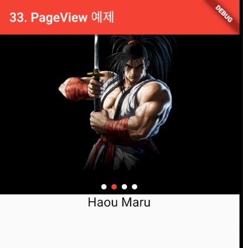

### PageView
> Flutter에서 PageView 사용하기

- [전체소스](../../lib/advance/PageViewExample.dart)
- [dartpad로 실행하기](#) - Dartpad에서 실행안됨

- PageView 위젯의 builder에서 화면을 구성한다.
  - controller에는 PageController()를 넘긴다.
  - onPageChanged는 viewport가 변경될 시( 중앙에 보이는 아이템이 이동시 ) 발생된다. (int index){} 함수를 구현하여 상태를 처리한다.
  - itemBuilder는 (_, i) { returnb 위젯}형의 함수로 Item 화면을 구현한다.
  - CirclePageIndicator()는 PageView의 이동을 표시하기 위해 사용한다.
    - currentPageNotifier는 Page가 변경될 시 처리하는 ChangeNotfier이다(이곳에서는 _currentPageNotifier 변수를 넘김).
    - final _currentPageNotifier = ValueNotifier<int>(0);와 같이 사용하며 setState() 없이도 값을 넣으면 widget에서 변경된다.
    - ex) _currentPageNotifier.value = index; // setState없이 CirclePageIndicator가 변한다.

~~~ dart
import 'package:flutter/material.dart';
import 'package:page_view_indicators/circle_page_indicator.dart';

class PageViewExample extends StatelessWidget {
  @override
  Widget build(BuildContext context) {
    return MaterialApp(
      title: '',
      theme: ThemeData(
        primarySwatch: Colors.red,
      ),
      home: PageViewContent(),
    );
  }
}

class PageViewContent extends StatefulWidget {
  @override
  PageViewContentState createState() {
    return new PageViewContentState();
  }
}

class PageViewContentState extends State<PageViewContent> {
  final _pageController = PageController();
  final _currentPageNotifier = ValueNotifier<int>(0);
  final _boxHeight = 250.0;

  var bannenItems = [
    Text("Haou Maru", style: TextStyle(color: Colors.white, fontSize: 30),),
    Image.network("https://www.snk-corp.co.jp/kr/games/samuraishodown/img/top/top01.png"),
    Text("Galford", style: TextStyle(color: Colors.white, fontSize: 30),),
    Image.network("https://static.wikia.nocookie.net/snk/images/4/43/Chara04.png/revision/latest?cb=20190405071545"),
  ];

  List<Widget> contentItems = [
    Text("Haou Maru", style: TextStyle(color: Colors.grey, fontSize: 30),),
    Text("Haou Maru", style: TextStyle(color: Colors.black, fontSize: 20),),
    Text("Galford", style: TextStyle(color: Colors.grey, fontSize: 30),),
    Text("Galford", style: TextStyle(color: Colors.black, fontSize: 20),),
  ];

  int selectedContent = 0;

  @override
  Widget build(BuildContext context) {
    return Scaffold(
      appBar: AppBar(
        title: Text('33. PageView 예제'),
      ),
      body: _buildBody(),
    );
  }

  Widget _buildBody() {
    return Column(
      children: <Widget>[
        Stack(
          children: <Widget>[
            _buildPageView(),
            _buildCircleIndicator()
          ],
        ),
        buildContent()
      ],
    );
  }

  Widget _buildPageView() {
    return Container(
      color: Colors.black,
      height: _boxHeight,
      child: PageView.builder(
          itemCount: bannenItems.length,
          controller: _pageController,
          itemBuilder: (BuildContext context, int index) {
            return Center(
              child: bannenItems[index],
            );
          },
          onPageChanged: (int index) {
            _currentPageNotifier.value = index;
            setState(() {
              selectedContent = index;
            });
          }),
    );
  }

  Widget _buildCircleIndicator() {
    return Positioned(
      left: 0.0,
      right: 0.0,
      bottom: 0.0,
      child: Padding(
        padding: const EdgeInsets.all(8.0),
        child: CirclePageIndicator(
          selectedDotColor: Colors.red,
          dotColor: Colors.white,
          itemCount: bannenItems.length,
          currentPageNotifier: _currentPageNotifier,
        ),
      ),
    );
  }

  Widget buildContent() {
    return Center(child: contentItems[selectedContent] );
  }
}

~~~
