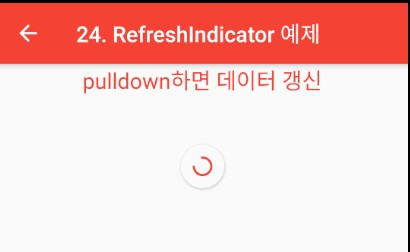

### RefreshIndicator
> Flutter에서 리스트뷰를 풀다운하여 갱신하기

- [전체소스](../../lib/advance/RefreshIndicatorExample.dart)
- [dartpad로 실행하기](#) - Dartpad 지원안함

- RefreshIndicator()를 이용하여 풀다운시 내용을 갱신할 수 있다.
- child에서 화면을 구성한다. onRefresh에서 데이터를 추가한다. 이때 넘겨지는 값은 async한 함수로 리턴값은 Future형이다.

~~~ dart
import 'dart:async';
import 'package:flutter/material.dart';

class RefreshIndicatorExample extends StatefulWidget {
  @override
  _RefreshIndicatorExampleState createState() => new _RefreshIndicatorExampleState();
}

class _RefreshIndicatorExampleState extends State<RefreshIndicatorExample> {
  var counter = 0;
  var items = <Widget>[];

  @override
  void initState() {
    super.initState();
  }

  @override
  Widget build(BuildContext context) {
    return Scaffold(
      appBar: AppBar(
        title: new Text("24. RefreshIndicator 예제"),
      ),
      body: Column(children: [
        Text("pulldown하면 데이터 갱신", style: TextStyle(fontSize: 20, color: Colors.red),),
        Expanded(child: RefreshIndicator(
          child: ListView(
            children: getItemsByDesc(),
          ),
          onRefresh: refreshHandler,
        ))
      ],),
    );
  }

  List<Widget> getItemsByDesc() {
    return items.reversed.toList();
  }

  Future<Null> refreshHandler() async {
    await Future.delayed(new Duration(seconds: 2));

    setState(() {
      addItems(counter++);
    });
  }

  void addItems(int n) {
    items.add(ListTile(
        title: Text("$n")));

    print(items.length);

  }
}
~~~
