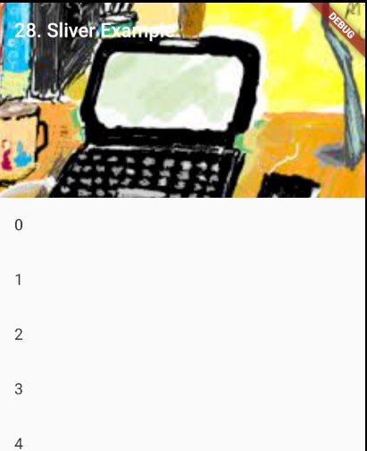

### StaggeredGridView
> Flutter에서 크기가 다른 GridView를 사용하기

- [전체소스](../../lib/advance/SliverExample.dart)
- [dartpad로 실행하기](#) - Dartpad 지원안함

- CustomScrollView 위젯의 slivers에 화면을 구성한다.
  - SliverAppBar는 AppBar를 구현한다.
    - floating, title은 접혀지는 효과여부와 보여줄 메시지를 지정한다.
    - flexibleSpace는 배경을 지정한다.
    - expandedHeight는 최대 크기이다.
  - SliverList는 리스트를 구현한다.
    - delegate에 (context, index) { returnb 위젯}형의 함수로 Item 화면을 그린다.
    - childCount에 Item의 갯수를 지정한다.

~~~ dart
import 'package:flutter/material.dart';

class SliverExample extends StatelessWidget {
  SliverExample({Key key}) : super(key: key);

  @override
  Widget build(BuildContext context) {
    final title = '28. Sliver Example';

    return MaterialApp(
      title: title,
      home: Scaffold(
        body: CustomScrollView(
          slivers: <Widget>[
            SliverAppBar(
              // Provide a standard title.
              title: Text(title),
              floating: true,
              flexibleSpace: Image.asset(
                  "assets/images/title.jpg", fit: BoxFit.cover),
              expandedHeight: 200,
            ),
            SliverList(
              delegate: SliverChildBuilderDelegate(
                    (context, index) => ListTile(title: Text('$index')),
                childCount: 100,
              ),
            ),
          ],
        ),
      ),
    );
  }
}
~~~
