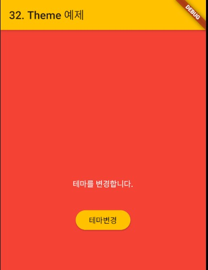

### Theme
> Flutter에서 Theme 설정하기

- [전체소스](../../lib/advance/ThemeExample.dart)
- [dartpad로 실행하기](https://dartpad.dev/954fb16232698cb8b4818422ff9b5e18?null_safety=false)

- MaterialApp 위젯의 theme에 ThemeData를 넘겨서 테마를 설정할 수 있다.
- ThemeData는
  - appBarTheme에서 AppBarTheme()를 넘겨 "AppBar"의 테마를 설정한다.
  - textTheme에서는 TextTheme()를 넘겨 "Text"의 테마를 설정한다.
  - buttonTheme에서는  ButtonThemeData()를 넘겨 "Button"의 테마를 설정한다.

~~~ dart
import 'package:flutter/material.dart';

class ThemeExample extends StatefulWidget {
  const ThemeExample({Key key}): super(key: key);
  @override
  _ThemeExampleState createState() => _ThemeExampleState();
}

class _ThemeExampleState extends State {

  String sTitle = '32. Theme 예제';
  bool isLight = true;

  @override
  void initState() {
    super.initState();
  }

  @override
  Widget build(BuildContext context) {
    return MaterialApp(
      title: sTitle,
      home: Scaffold(
        appBar: AppBar(
          title: Text(sTitle),
          backgroundColor: Theme.of(context).appBarTheme.color,
          textTheme: Theme.of(context).textTheme,
        ),
        body: Center(child: Column(
          mainAxisAlignment: MainAxisAlignment.center,
          children: [
            const SizedBox(
              height: 32.0,
            ),
            Text('테마를 변경합니다.'),
            const SizedBox(
              height: 32.0,
            ),
            RaisedButton(
              child: Text('테마변경'),
              onPressed: () => setState(() { isLight = !isLight;}),
            ),
          ],
        ),),
      ),
      theme: getTheme(),
    );
  }

  ThemeData getTheme() {if (isLight == true) return CustomTheme.lightTheme; else return CustomTheme.redTheme;}
}

class CustomTheme {
  static ThemeData get lightTheme {
    return ThemeData(
        appBarTheme: AppBarTheme(backgroundColor: Colors.white),
        textTheme: TextTheme(body1: TextStyle(color: Colors.grey), body2: TextStyle(color: Colors.grey)),
        scaffoldBackgroundColor: Colors.white,
        buttonTheme: ButtonThemeData(
            shape: RoundedRectangleBorder(borderRadius: BorderRadius.circular(10.0)),
            buttonColor: Colors.white,
            height: 60

        )
    );
  }

  static ThemeData get redTheme {
    return ThemeData(
        appBarTheme: AppBarTheme(backgroundColor: Colors.amber),
        textTheme: TextTheme(body1: TextStyle(color: Colors.white)),
        scaffoldBackgroundColor: Colors.red,
        buttonTheme: ButtonThemeData(
          shape: RoundedRectangleBorder(borderRadius: BorderRadius.circular(28.0)),
          buttonColor: Colors.amber,
          textTheme: ButtonTextTheme.primary,
        )
    );
  }
}

~~~
