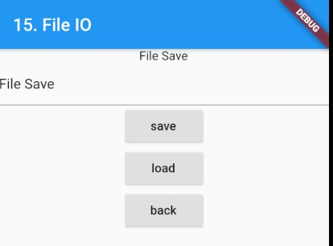

### File
> Flutter에서 파일처리법

- [전체소스](../../lib/io/FileIOExample.dart)
- [dartpad로 실행하기](https://dartpad.dev/549df87e1a95fee23e25ad3b064a8217?null_safety=false) - DartPad에서 dart IO 지원안함. 실행안됨.

- pubspec.yaml에 path_provider: ^1.6.24를 추가한다
- File 처리는 비동기방식으로 해야 한다.
- import 'package:path_provider/path_provider.dart'로 import 한다.
- **getApplicationDocumentsDirectory**를 호출하여 디바이스 경로를 가져온다.
~~~dart
  ...
  
  Future<String> get _localPath async {
    final directory = await getApplicationDocumentsDirectory();
    return directory.path;
  }

  Future<File> get _localFile async {
    final path = await _localPath;
    return File('$path/test.txt');
  }

  ...
  
~~~

- File을 문자열로 읽을 때는 readAsString()
- File을 문자열로 쓸 때에는 writeAsString(문자열)

~~~dart
  Future<String> readStr() async {
    try {
      final file = await _localFile;

      String contents = await file.readAsString();
      return contents;
    } catch (e) {
      return "";
    }
  }
  
  Future<File> writeStr(String s) async {
    final file = await _localFile;
    return file.writeAsString(s);
  }
~~~

