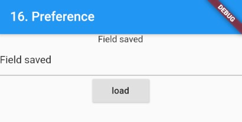

### Prefernce
> Flutter에서 Preference

- [전체소스](../../lib/io/PrefExample.dart)
- [dartpad로 실행하기](#) - DartPad에서 지원안함. 실행안됨.

- pubspec.yaml에 shared_preferences: ^0.5.12+4를 추가한다
- import 'package:shared_preferences/shared_preferences.dart'로 import 한다.
- 비동기로 pref 개체를 가져온다.
~~~dart
  ...
  Future<SharedPreferences> _prefs = SharedPreferences.getInstance();
  ...
~~~
- SharedPreferences를 이용해 String 값을 가져오고 싶다면 필드명을 파라메터로 getString("필드명")을 실행한다.
- 비동기로 처리한다.
~~~dart
  ...
  _prefs.then((SharedPreferences prefs) {
      setState(() {
        _str = prefs.getString(prefFIELD) ?? "";
      });
  });
  ...
~~~

- SharedPreferences를 이용해 String 값을 저장하고 싶다면 setString("필드명", 값)을 실행한다.
- 비동기로 처리한다.

~~~dart
   ...
   _prefs.then((SharedPreferences prefs) {
     prefs.setString(prefFIELD, text).then((bool success) {
       print("success");
     });
   });
   ...
~~~

