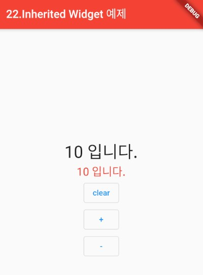

### Inherited Widget
> Flutter에서 Inherited Widget을 통한 상태관리

- [전체소스](../../lib/statemanagement/InheritedWidgetExample.dart)
- [dartpad로 실행하기](https://dartpad.dev/3d3bb7b5c851985572ff67c407ff82f0)

- Inherited Widget로 정의된 위젯의 자식 위젯(child)에게 상태를 공유할 수 있다.
- 주로 외부에서 정의된 변수값이나 함수를 바인딩하는 목적으로 사용한다.
- of(BuildContext context)와 updateShouldNotify(covariant RootState oldWidget)를 오버라이드 한다.
- updateShouldNotify의 경우, 갱신조건을 처리한다. oldWidget은 updateShouldNotify()를 실행하기 이전 객체정보이다. 이곳에서 특정 필드값이 변경되면 갱신할 수 있도록 프로그래밍이 가능하다.

~~~dart
  ...
  class RootState extends InheritedWidget {
    RootState({
      Key key,
      @required this.clear,
      @required this.count,
      @required Widget child, // 화면에 보여질 위젯
    }) : super(key: key, child: child);

    // << 외부값과 연결 바인딩 >>
    // 실제 데이터와 Action은 외부에서
    // 구현하고 이곳에서는 바인딩(연결)만 관리
    final Function clear;
    final int count;

    // 외부에서 접근할 시 사용하는 메소드
    static RootState of(BuildContext context) {
      return context.dependOnInheritedWidgetOfExactType<RootState>();
    }

    // 갱신조건
    @override
    bool updateShouldNotify(covariant RootState oldWidget) {
      return oldWidget.count != count;
    }
  }

  ...
  
~~~

아래는 RootState에 값을 바인딩하는 예제이다.
~~~dart
  class _InWidgetExampleState extends State<_InWidgetExample> {
    int _count = 10;
    void clearCount() {
      setState(() {
        _count = 0;
      });
    }

    @override
    Widget build(BuildContext context) {
      return Center(
        child: Column(
          mainAxisAlignment: MainAxisAlignment.center,
          children: [
            // ** 하위 위젯에서 rootState를 액세스 가능
            RootState(
              clear: clearCount,
              count: _count, // 외부값과 바인딩함
              child: Column(
                children: [ChildOne(), ChildTwo(), ChildThree()],
              )),

     ... 
~~~

- Child Widget에서는 RootState.of(context)를 통해 Inherited Widget 정보를 가져올 수 있다.
- 그리고 RootState에서 바인딩으로 정의된 값들을 사용할 수 있다.
~~~dart
  ...
  
  final RootState rs = RootState.of(context);
    return Center(
      child: Text(
        "${rs.count} 입니다.",
        style: TextStyle(fontSize: 30),
      ),
    )
    
  ...
  
  class ChildThreeState extends State<ChildThree> {
    Widget build(BuildContext context) {
      final RootState rs = RootState.of(context);
      return Center(
          child: OutlinedButton(
        child: Text('clear'),
        onPressed: () {
          setState(() {
            rs.clear();
          });
        },
      ));
    }
  }  
~~~