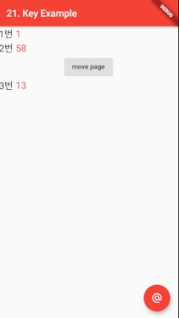

### Key
> Flutter에서 Key

- [전체소스](../../lib/statemanagement/KeyExample.dart)
- [dartpad로 실행하기](#)

- key: ValueKey(), UniqueKey()와 같이 키값을 지정한다.
- 프레임웍에서는 위젯을 재정렬(refreash, rebuild)할 때, 키값을 보고 매칭한다.
- 이 때, 키값이 없는 위젯은 잘못된 매칭으로 재대로 갱신되지 못한다.

~~~dart
  ...
  class _KeyExamplePageState extends State<KetExamplePage> {
  List<Widget> lstItmes = [
    ChildWidget(sTitle: "1번 ", key: UniqueKey()),
    ChildWidget(sTitle: "2번 ", key: UniqueKey()),
  ];

  ...
  
~~~

- Child Widget에서 부모위젯의 정보를 이용해야 할 경우, 또는 다른위젯과 정보를 공유해야 할 때는 GlobalKey()를 이용한다.
- GlobalKey<_ChildState> _ChildState1;
- 그리고 자식위젯을 생성시에 Key 값으로 넘긴다.
~~~dart
  // key값에 UniqueKey가 아닌 GlobalKey로 _ChildState1를 설정함
  // 글로벌변수처럼 사용하기 위함임.
  
  // 화면이동
  MaterialPageRoute(builder: (context) {
    return OtherPage(_ChildState1);
  })

  ...
  
  class OtherPage extends StatefulWidget {
    GlobalKey<_ChildState> changeKey;
    OtherPage( this.changeKey){
      print(this.changeKey.currentState.myNumber);
    }
    @override
    _OtherPageState createState() => _OtherPageState();
  }
  class _OtherPageState extends State<OtherPage> {
    @override
    Widget build(BuildContext context) {
      return Scaffold(
        appBar: AppBar(),
        body: Center(
            child: Column(children: [
              SizedBox(height: 15,),
              Text("(+) 누르면 이전페이지 값도 변경됨", style: TextStyle(color: Colors.red, fontSize: 16),),
              SizedBox(height: 15,),
              Text("${widget.changeKey.currentState.myNumber}", style: TextStyle(color: Colors.red, fontSize: 26),),
              IconButton(icon: Icon(Icons.add), onPressed: (){
                setState(() {
                  widget.changeKey.currentState.increase();
                });
              })
            ],)
        )
      );
    }
  }
~~~